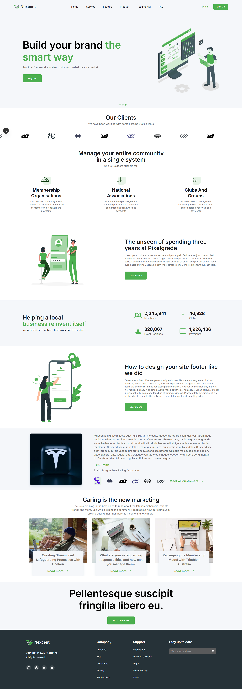
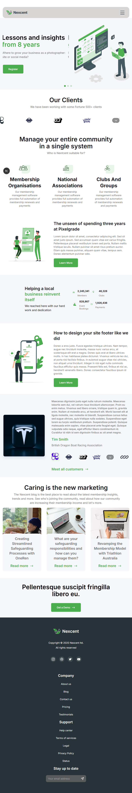
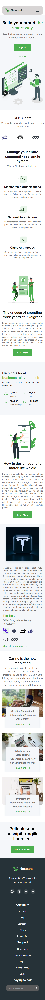

This is a [Next.js](https://nextjs.org) project bootstrapped with [`create-next-app`](https://nextjs.org/docs/app/api-reference/cli/create-next-app).

## Getting Started

First, run the development server:

```bash
npm run dev
# or
yarn dev
# or
pnpm dev
# or
bun dev
```

# Links 
- **Live Demo:** [View Live Project](https://nexcent-ui-six.vercel.app/)
- **GitHub Repository:** [View Source Code](https://github.com/ashishverma94/nexcent-ui)

# Screenshots - Responsiveness

<p align="center">
  
  
  
</p>

